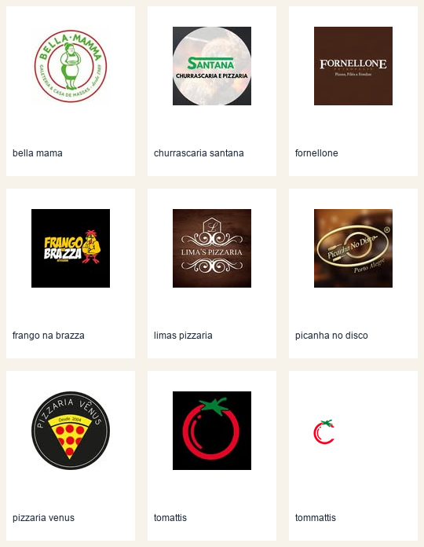

# Inventario de logos e referencias visuais

Este inventario separa logo oficial de referencia visual. Referencia visual ajuda a entender cor, estilo e linguagem, mas nao deve ser usada como logo final em criativo aprovado pelo cliente sem validacao.

## Politica de uso

- Arquivo oficial validado: pode ser usado pelo sistema como camada externa, sem passar pelo gerador de imagem.
- Referencia visual publica: pode orientar manual, paleta e tom, mas nao deve ser aplicado como logo final.
- Perfil de Instagram/Linktree: geralmente vem em baixa resolucao, com corte circular e compressao. Serve para estudo, nao para arte final.
- Arquivo necessario por cliente: PNG transparente ou SVG oficial, preferencialmente em versao horizontal, vertical e monocromatica.

## Itens

| Cliente | Arquivo | Status | Uso recomendado |
| --- | --- | --- | --- |
| Bella Mamma | `_logos/bella-mama-instagram-profile-reference.jpg` | Referencia publica | Entender simbolo circular, verde/vermelho e linguagem de galeteria tradicional. Solicitar logo oficial. |
| Churrascaria Santana | `_logos/churrascaria-santana-instagram-profile-reference.jpg` | Referencia publica | Entender combinacao verde/vermelho/amarelo e assinatura simples. Solicitar logo oficial. |
| Fornellone | `_logos/fornellone-instagram-profile-reference.jpg` | Referencia publica | Entender marrom escuro, serifado e assinatura italiana. Solicitar logo oficial. |
| Frango na Brazza | `_logos/frango-na-brazza-instagram-profile-reference.jpg` | Referencia publica correta | Perfil confirmado pela OTG. Entender fundo preto, amarelo/vermelho e mascote/frango. Solicitar logo oficial em PNG/SVG. |
| Lima's Pizzaria | `_logos/limas-pizzaria-instagram-profile-reference.jpg` | Referencia publica | Entender brasao/ornamento e tons escuros. Site oficial usa identidade preta/amarela. Solicitar logo oficial. |
| Picanha no Disco | `_logos/picanha-no-disco-instagram-profile-reference.jpg` | Referencia publica | Entender oval premium, preto/dourado e textura de brasa. Solicitar logo oficial. |
| Pizzaria Venus | `_logos/pizzaria-venus-instagram-profile-reference.jpg` | Referencia publica | Entender pizza/planeta, preto, vermelho e amarelo. Solicitar logo oficial. |
| Tommatti's | `_logos/tommattis-logo-site.png` | Logo baixado do site oficial | Pode orientar a aplicacao, mas ainda ideal solicitar arquivo original em PNG/SVG. Nao passar pelo gerador. |
| Tommatti's | `_logos/tomattis-instagram-profile-reference.jpg` | Referencia publica | Apoio visual secundario. |

## Requisito para o produto

Antes de liberar um cliente como "brand safe", cadastrar no sistema:

- logo principal em PNG transparente ou SVG;
- logo reduzido/icone, se existir;
- cores oficiais em HEX;
- fontes oficiais ou substitutas licenciadas;
- operacao confirmada: horario, unidade, delivery/presencial, produtos proibidos e produtos prioritarios.
